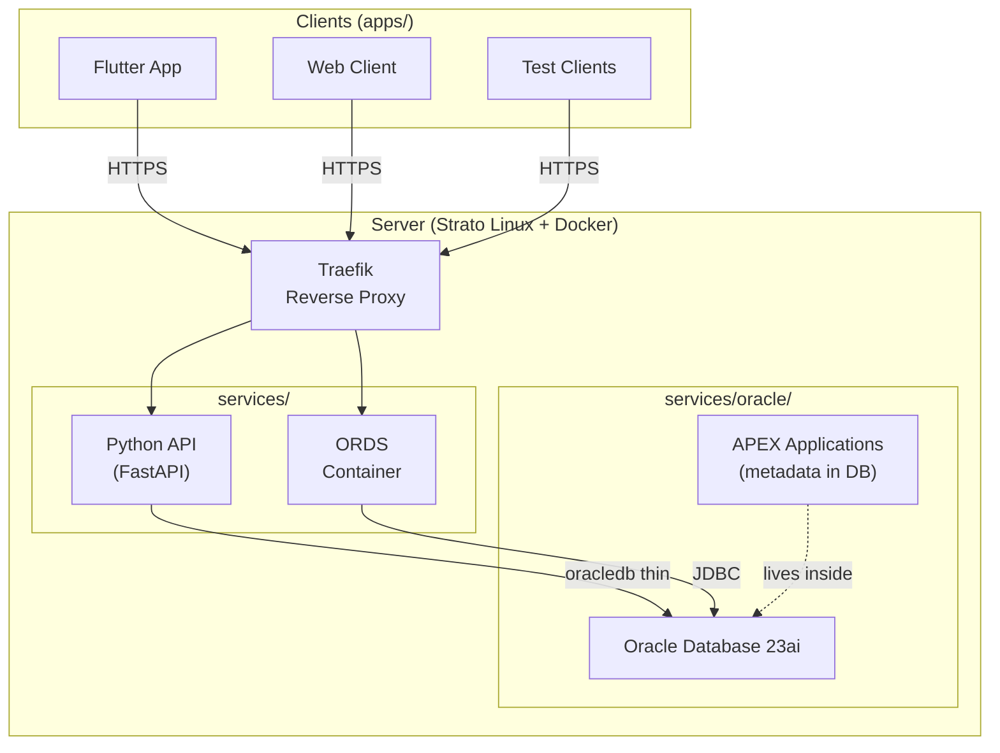

# chrisbuilds64/sdlc

**A public reference stack for Software Lifecycle Management in the AI era.**

> You can't teach lifecycle management with slides. So I'm building it instead.

This repository is a living demonstration of what a disciplined software lifecycle looks like when AI-assisted development is the default. Every architectural decision is documented. Every component is reproducible. Every environment is explicit.

Built in public by [@chrisbuilds64](https://github.com/chrisbuilds64).

---

## What This Is

A complete, opinionated software stack covering:

- **Server provisioning** via Ansible (infrastructure as code)
- **Container orchestration** via Docker Compose + Traefik
- **Database deployment** via Oracle 23ai + migration-based versioning (Liquibase/SQLcl)
- **REST layer** via ORDS (Oracle REST Data Services)
- **Application API** via Python (FastAPI) — the only interface to the database
- **Three environments**: Dev, Test, Prod — with explicit promotion gates

This is not a product. It is a reference architecture and a build-in-public series.

---

## Architecture



**Core principle:** The Python API is the only application interface to Oracle. No consumer touches the database directly. See [ADR-002](docs/adr/002-api-only-db-access.md).

---

## Repository Structure

```
sdlc/
├── docs/
│   └── adr/                  # Architecture Decision Records
├── infra/
│   ├── ansible/              # Server provisioning playbooks
│   └── traefik/              # Reverse proxy configuration
├── services/
│   ├── oracle/               # DB schema, migrations (Liquibase/SQLcl)
│   ├── ords/                 # ORDS configuration
│   ├── apex/                 # APEX application exports
│   └── python-api/           # FastAPI backend + Dockerfile
├── apps/                     # API consumers (Flutter, web clients)
├── shared/
│   └── openapi.yaml          # API contract (single source of truth)
└── .github/
    └── workflows/            # CI/CD pipelines
```

---

## Environments

| Environment | Subdomain | Deploy Trigger | Data |
|---|---|---|---|
| Dev | dev.chrisbuilds64.com | Push to `develop` | Synthetic |
| Test | test.chrisbuilds64.com | Push to `release/*` | Stable dataset |
| Prod | api.chrisbuilds64.com | Manual after tag on `main` | Real data |

Branching: `feature/*` → `develop` → `release/*` → `main` → tag `v1.x.x`

---

## Build Log

Each component ships with a companion post in [The Build Log](https://chrisbuilds64.substack.com).

- **TOP-005** — [The Reference Stack](https://chrisbuilds64.substack.com) — *Why I built this and how it's structured*
- More coming as each phase ships.

---

## Quick Start

> Coming in Phase 1. Oracle 23ai local setup + Python API hello world.

---

## Architecture Decision Records

| ADR | Title | Status |
|---|---|---|
| [001](docs/adr/001-monorepo.md) | Monorepo Structure | Accepted |
| [002](docs/adr/002-api-only-db-access.md) | API-Only Database Access | Accepted |
| [003](docs/adr/003-environment-strategy.md) | Three-Environment Strategy | Accepted |
| [004](docs/adr/004-ords-separate-container.md) | ORDS as Separate Container | Accepted |

---

## License

MIT — fork it, adapt it, argue with it.

---

*I'm Christian. 40 years in enterprise IT. Building in public at [chrisbuilds64.com](https://chrisbuilds64.com).*
